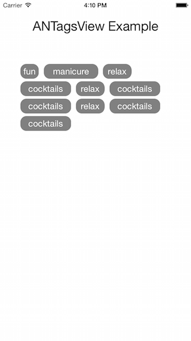
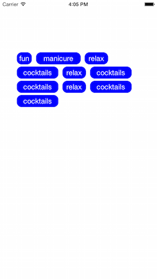

# ADTagsView - Customizable View for Hashtags

Basic useful feature list:

 * Create dynamic height View for Hash tags
 * Customizeable look and feel for Tags.
 
## Screenshot



## Usage
here's some example code! :+1:

```objective-c
    ANTagsView *tagsView = [[ANTagsView alloc] initWithTags:tagsToDisplay];
    [tagsView setTagCornerRadius:12];
    [tagsView setTagBackgroundColor:[UIColor blueColor]];
    [tagsView setTagTextColor:[UIColor whiteColor]];
    [tagsView setBackgroundColor:[UIColor whiteColor]];
    [tagsView setFrameWidth:300];
```
